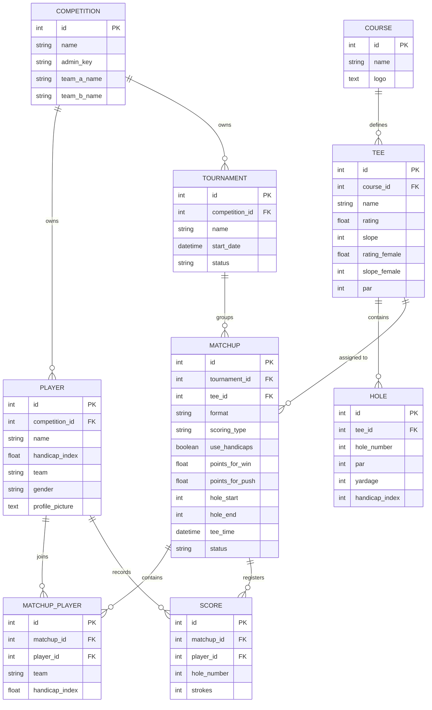

# 🐍 Golf Competition Backend Engine

Welcome to the backend of the Golf Competition Web App. This service is a lightweight, high-performance Flask application that serves as the **database storage orchestrator**, **USGA WHS Course Handicap calculator**, and **live Match Play status engine**.

---

## 📁 Directory Structure

```text
backend/
├── app.py              # Flask Application Factory & Initialization
├── config.py           # Multi-environment config (SQLite local / PostgreSQL production)
├── pytest.ini          # Pytest collection and path configurations
├── requirements.txt    # Python package dependencies
├── models/
│   ├── __init__.py     # SQLAlchemy DB context
│   └── models.py       # Core Multi-Tenant Database Schema (tenanted via Competition)
├── routes/             # REST Endpoints
│   ├── admin.py        # Secure actions managed via 'admin_key' headers
│   ├── play.py         # Scoring and live match mutations
│   └── query.py        # Status reading for leaderboards & matchups
├── services/           # The mathematical brains of the app
│   ├── handicap.py     # USGA WHS Math, allowances (Shamble/Scramble) and pops
│   └── match_engine.py # Hole-by-hole relative netting, push logic, & thru-18 statuses
├── scratch/            # Utility and local ad-hoc sandbox scripts
│   ├── scratch_batch.py# Sandbox payload sender
│   └── scratch_db.py   # Quick local database inspector
└── tests/              # Fast Pytest suite (asserts handicap, Shamble, and 2v2 rules)
```

---

## 🏛 Database Schema (ER Diagram)

This schema is strictly structured around multi-tenancy. Every `Player`, `Tournament`, and secure administrative event belongs to a root `Competition`. Competitions are isolated lightweight tenants protected by a flat, secure `admin_key` rather than a heavyweight authentication system.



---

## 🧮 Core Algorithms & Services

> [!NOTE]
> **BACKEND-FIRST COMPUTATION PRINCIPLE:**
> The backend services serve as the single source of truth for all mathematical logic, statistics, handicap allocations, stroke distributions, and leaderboard rankings. The React frontend must remain a presentation layer with zero computation, scoring math, or raw data parsing logic.

If you are modifying calculations, you must maintain standard USGA WHS mathematical guarantees.

### 1. Course Handicap & Allowances (`services/handicap.py`)
* **Standard USGA WHS Course Handicap Formula:**  
  $$Course\ Handicap = \left(Handicap\ Index \times \frac{Slope}{113}\right) + (Rating - Par)$$
  *Females utilize `rating_female` and `slope_female` if populated on the tee box.*
* **Format Allowances:**
  * **Shamble (2-Person):** Individual Course Handicaps are calculated unrounded, multiplied by a **75%** allowance, and then rounded (`round_half_up`).
  * **Shamble (4-Person):** Multiplied by a **65%** allowance and rounded.

### 2. Relative Stroke Allocation (Pops)
* The lowest-handicap player in the matchup acts as the scratch baseline (reduced to `0` playing handicap).
* Every other player's handicap is reduced by the baseline minimum (e.g. if A has 8 strokes and B has 15 strokes, playing handicaps are A=0, B=7).
* Strokes (dots) are distributed to holes sequentially by difficulty index (`handicap_index` of the `Hole` record), starting from the hardest (SI 1) up to the easiest (SI 18).

### 3. Match Play Standings Engine (`services/match_engine.py`)
* Compares net strokes (gross minus allocated relative pops) hole-by-hole.
* Computes status strings such as:
  * `"Team A is 2 UP thru 14"`
  * `"AS thru 9"` (All Square)
  * `"Final: AS"`
  * `"Team B wins 3 & 2"` (Decision locking: when the margin of lead is greater than the number of remaining holes).

---

## 🧪 Testing and Execution

### Running Pytest Suite
The environment utilizes a strict `pytest` implementation to prevent regressions across formatting mathematics.

```bash
# Verify virtual environment
source venv/bin/activate

# Execute all tests
python -m pytest
```

### Running Scratch Scripts
To run ad-hoc validation or test requests against a live DB without writing to the main app flow:
```bash
python scratch/scratch_db.py
python scratch/scratch_batch.py
```
